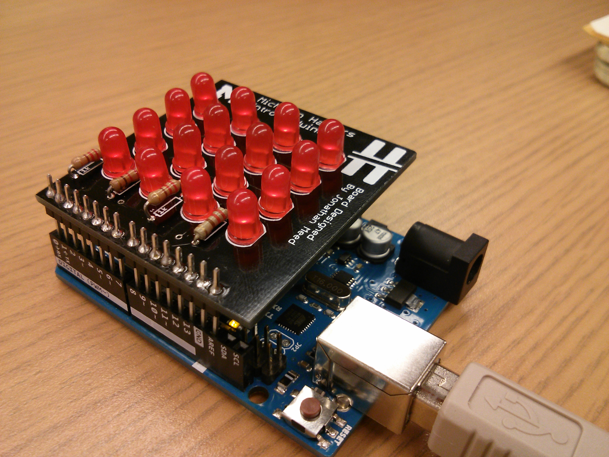

Intro to Arduino
============
The support files from the Intro to Arduino and soldering tech talk on Tuesday, November 11 ([presentation can be found here](https://docs.google.com/presentation/d/1E4pHrHvP_do1yQn8vXZZbs_XZ4VM9lmU6rJVV6FsNSU/edit#slide=id.g4b07b791c_350)). In the hardware folder is copies of the Eagle schematic and board layout for the 4x4 LED Arduino shield given to particpants, and in the firmware folder is the library to simplify working with the shield.

The 4x4 LED Arduino shield given to participants. You like it? You should have come!

###How to Install the Library
* Inside of the Arduino IDE, go to Sketch->Import Library->Add Library.
* Choose the *LEDGrid* folder inside of the firmware folder.
* The Arduino IDE handles the rest!
* Be sure to check out the example animation (File->Examples->LEDGrid) if you're unsure how to work with the library, or what to do!